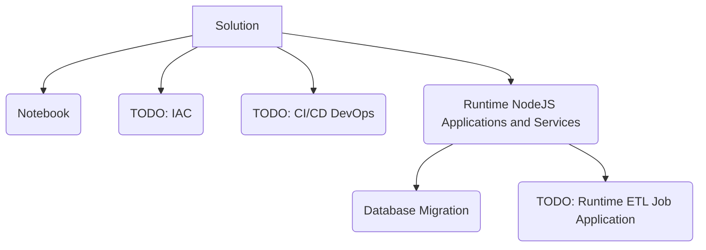

# Data Engineer Code Challenge

Monorepo Code challenge for Extracting, Validating, Transforming and the Loading Cricket to Datasets

# Getting Started

Install pnpm
```bash
npm install pnpm -g
```

Install node_modules
```bash
pnpm install
```
## Install Docker daemon
See this [link](https://docs.docker.com/engine/install/) for the installer.

## Running development database that serves us the target Database
```bash
docker-compose up -d
```

## DB Migrations
This is required to create target data base schema. See the child [README](./apps/packages/migration/README.md) for instruction.

## Running the notebook 
This has all the data explorations solutions. See the [README](./notebooks/README.md) for the instruction on how to run it. 


# Monorepo Project Structure


